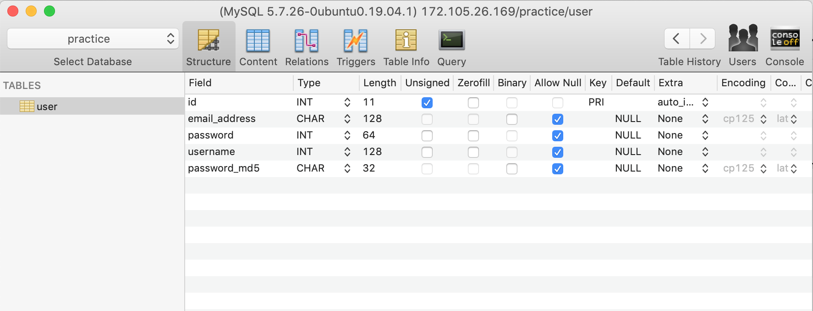

## Change The Environment Variables
Change these to your host IP, database, user, password, and database:
  ```javascript
  // line 9, api.js
  this.connection = mysql.createConnection({
    host: process.env.HOST,
    user: process.env.DBUSER, //Don't use `USER` because it's already an environment variable
    password: process.env.PASSWORD,
    database: process.env.DATABASE
  })
  ```

  ## Table Setup
  This is how my table is set up:
  